# chicken_states - State Management System

Ein umfassendes State-Management-System für Bevy-basierte Spiele, das hierarchische Zustandsmaschinen mit Event-gesteuerten Übergängen bereitstellt.

## Übersicht

Das `chicken_states`-Crate implementiert ein mehrschichtiges State-Management-System für Spiele mit den folgenden Kernkonzepten:

- **Hierarchische Zustände**: States können als `States`, `SubStates` und `ComputedStates` organisiert werden
- **Event-gesteuerte Übergänge**: Alle State-Änderungen erfolgen über Events, die von Observern validiert und verarbeitet werden
- **Feature-basierte Kompilierung**: Unterstützt sowohl grafische Clients (`hosted`) als auch Headless-Server (`headless`)
- **Validierte Transitionen**: Jeder State-Übergang wird durch Validator-Funktionen auf Gültigkeit geprüft

### Modulstruktur

```
src/
├── lib.rs           # Crate-Root mit Plugin-Definition
├── states/          # Alle State-Definitionen
│   ├── app.rs       # AppScope (Splash, Menu, Session)
│   ├── session.rs   # SessionType, SessionState, Server-/Client-States
│   └── menu/        # Menü-States (Main, Singleplayer, Multiplayer, etc.)
├── events/          # Alle Events für State-Änderungen
│   ├── app.rs       # AppScope-Events
│   ├── session.rs   # Session-Events
│   └── menu/        # Menü-Events
└── logic/           # Observer und Validierungslogik
    ├── app.rs       # App-Logik
    ├── session/     # Server- und Client-Session-Logik
    └── menu/        # Menü-Logik
```

## State-Hierarchie

### Top-Level: AppScope

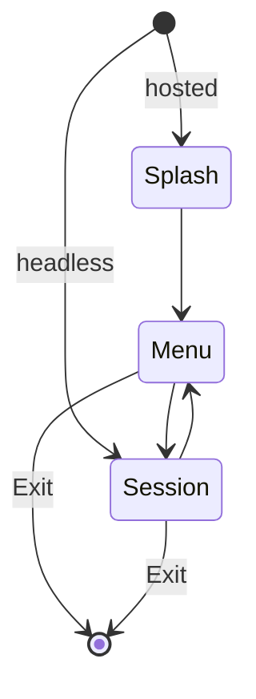

Der `AppScope` definiert die höchste Ebene der Anwendung:

| State | Beschreibung | Feature |
|-------|--------------|---------|
| `Splash` | Startbildschirm mit Logo | `hosted` |
| `Menu` | Hauptmenü | `hosted` |
| `Session` | Aktive Spielsession | beide |

### SessionType (Unterzustand von AppScope::Session)

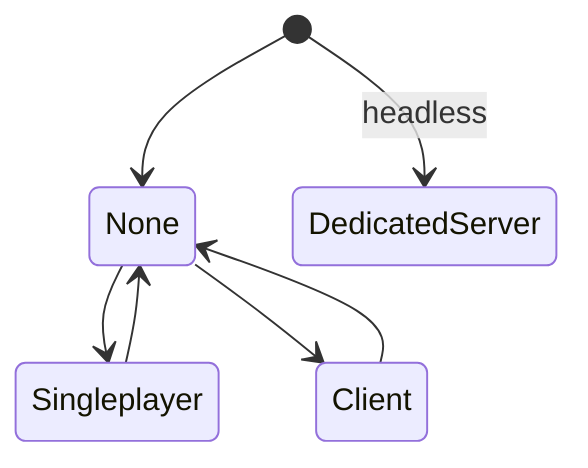

| State | Beschreibung | Feature |
|-------|--------------|---------|
| `None` | Keine aktive Session | beide |
| `Singleplayer` | Einzelspieler oder Host | `hosted` |
| `Client` | Client-Verbindung zu Server | `hosted` |
| `DedicatedServer` | Dedizierter Server | `headless` |

**Wichtig**: Direkte Übergänge zwischen `Singleplayer`, `Client` und `DedicatedServer` sind nicht erlaubt. Der Wechsel muss immer über `None` erfolgen.

### SessionState (Unterzustand von AppScope::Session)

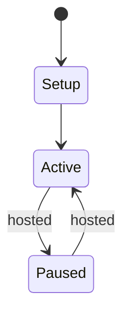

| State | Beschreibung |
|-------|--------------|
| `Setup` | Initialisierungsphase |
| `Active` | Aktives Spiel (Physik läuft) |
| `Paused` | Pausiert (nur Client) |

### ComputedState: PhysicsSimulation

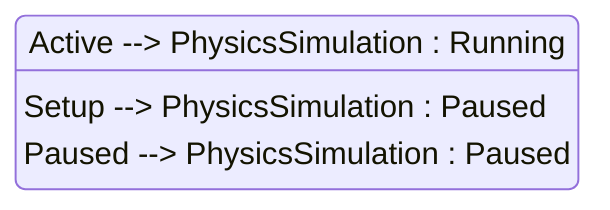

Dieser Zustand wird automatisch aus `SessionState` berechnet:
- `Running`: Wenn `SessionState::Active`
- `Paused`: Wenn `SessionState::Setup` oder `SessionState::Paused`

### Server-States (Singleplayer/DedicatedServer)

#### ServerStatus

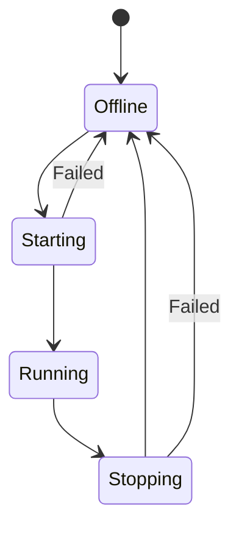

#### ServerStartupStep (Unterzustand von ServerStatus::Starting)

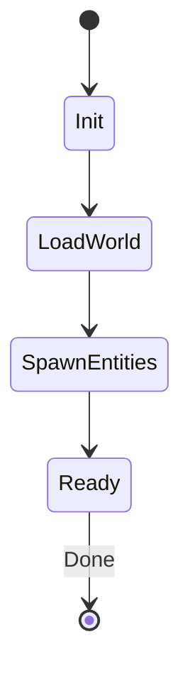

| Step | Beschreibung |
|------|--------------|
| `Init` | Initialisierung |
| `LoadWorld` | Welt laden/generieren |
| `SpawnEntities` | Entities spawnen |
| `Ready` | Bereit zum Spielen |

#### ServerShutdownStep (Unterzustand von ServerStatus::Stopping)

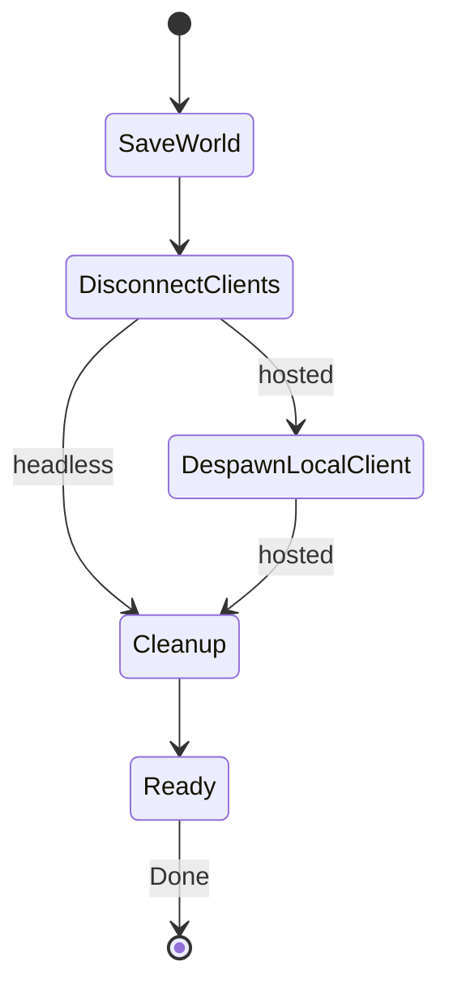

| Step | Beschreibung |
|------|--------------|
| `SaveWorld` | Welt speichern |
| `DisconnectClients` | Clients trennen |
| `DespawnLocalClient` | Lokalen Client entfernen (nur hosted) |
| `Cleanup` | Aufräumen |
| `Ready` | Fertig |

#### ServerVisibility (Unterzustand von ServerStatus::Running)

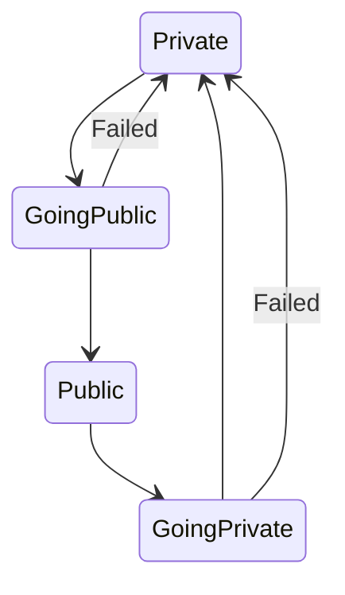

#### GoingPublicStep (Unterzustand von ServerVisibility::GoingPublic)

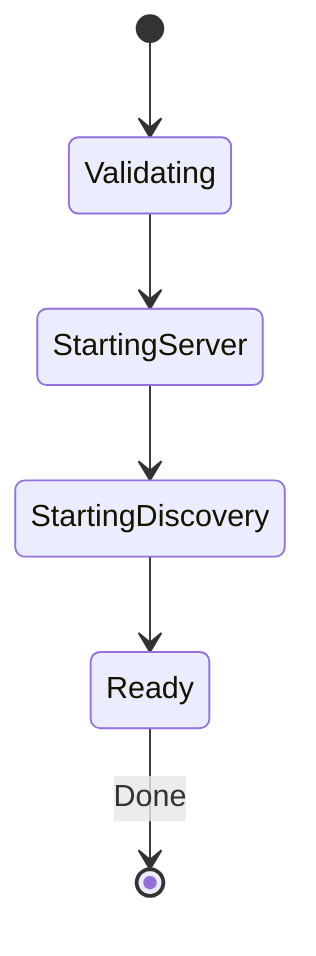

#### GoingPrivateStep (Unterzustand von ServerVisibility::GoingPrivate)

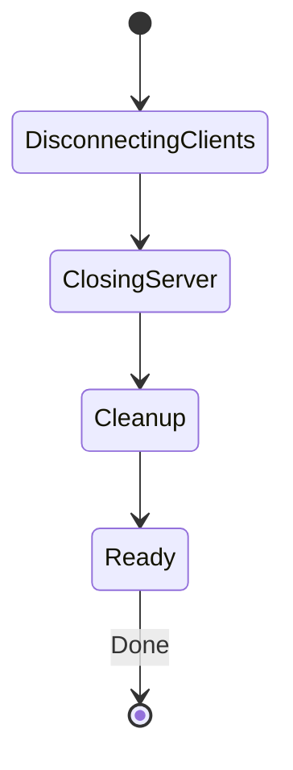

### Client-States (nur hosted)

#### ClientConnectionStatus

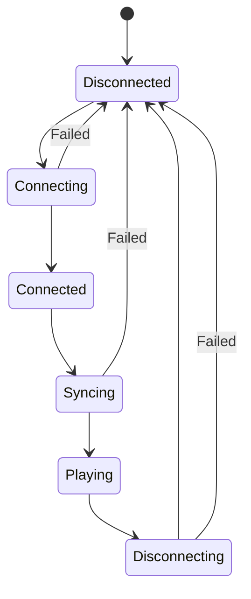

#### ConnectingStep (Unterzustand von ClientConnectionStatus::Connecting)

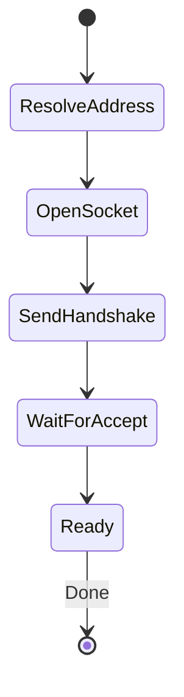

| Step | Beschreibung |
|------|--------------|
| `ResolveAddress` | DNS-Auflösung |
| `OpenSocket` | Socket öffnen |
| `SendHandshake` | Handshake senden |
| `WaitForAccept` | Auf Akzeptanz warten |
| `Ready` | Verbunden |

#### SyncingStep (Unterzustand von ClientConnectionStatus::Syncing)

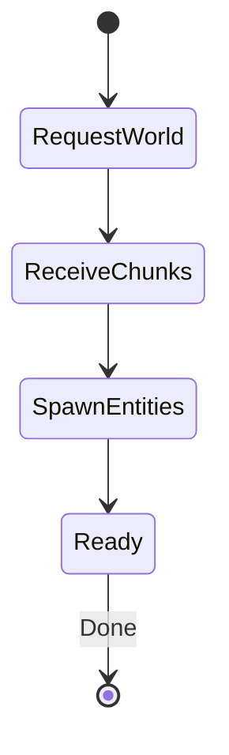

| Step | Beschreibung |
|------|--------------|
| `RequestWorld` | Welt anfordern |
| `ReceiveChunks` | Chunks empfangen |
| `SpawnEntities` | Entities spawnen |
| `Ready` | Synchronisiert |

#### DisconnectingStep (Unterzustand von ClientConnectionStatus::Disconnecting)

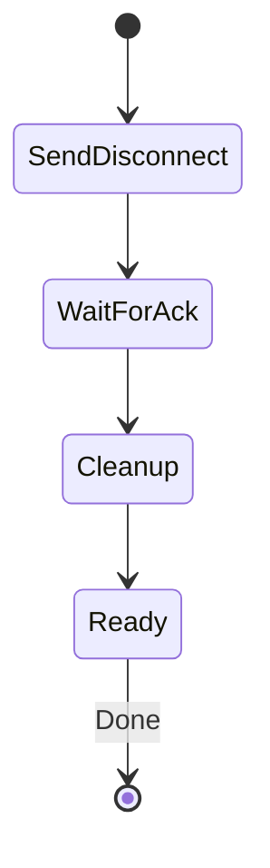

### Pause-Menu States (nur hosted)

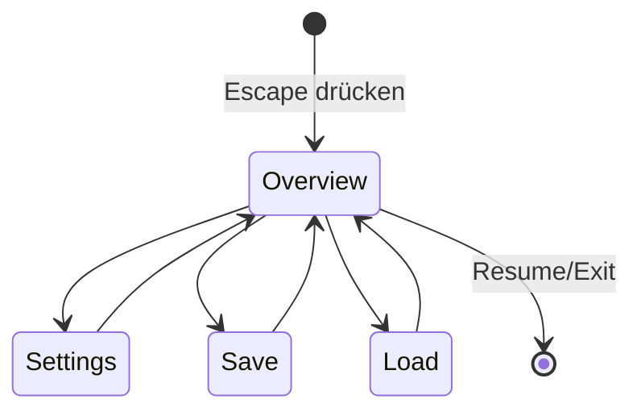

### Menü-States

#### MainMenuScreen (Unterzustand von AppScope::Menu)

```mermaid
stateDiagram-v2
    [*] --> Overview : SetAppScope::Menu
    Overview --> Singleplaye : SetSingplayerMenu::Overview
    Overview --> Multiplayer
    Overview --> Wiki
    Overview --> Settings
    Singleplayer --> Overview : SetSingplayerMenu::Back
    Multiplayer --> Overview
    Wiki --> Overview
    Settings --> Overview
```

#### SingleplayerMenuScreen (Unterzustand von MainMenuScreen::Singleplayer)

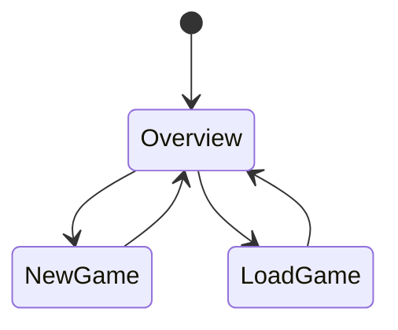

#### NewGameMenuScreen (Unterzustand von SingleplayerMenuScreen::NewGame)

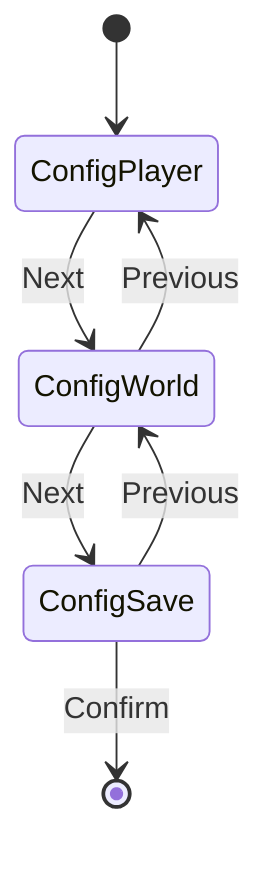

#### MultiplayerMenuScreen (Unterzustand von MainMenuScreen::Multiplayer)

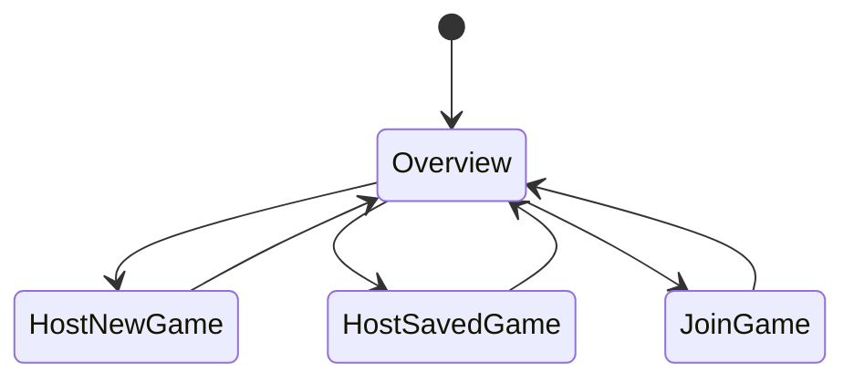

#### HostNewGameMenuScreen (Unterzustand von MultiplayerMenuScreen::HostNewGame)

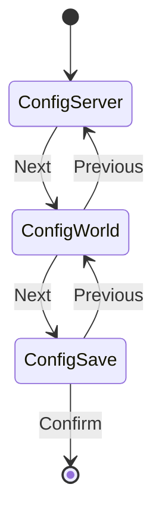

## Workflow-Dokumentation

### 1. AppScope-Übergänge (Splash → Menu → Session)

#### Splash → Menu

**Trigger**: Automatisch nach 5 Sekunden oder Escape-Taste

```rust
// Automatisch durch Splash-Timer
// Oder manuell:
commands.trigger(SetAppScope::Menu);
```

**Zustandsänderungen**:
- `AppScope`: Splash → Menu
- `MainMenuScreen`: wird auf `Overview` gesetzt
- `SessionType`: bleibt `None`

#### Menu → Session

**Trigger**: Spiel starten (Singleplayer, Multiplayer Host, oder Join)

```rust
commands.trigger(SetAppScope::Session);
```

**Zustandsänderungen**:
- `AppScope`: Menu → Session
- `SessionState`: Setup (Standard)

#### Session → Menu

**Trigger**: Spiel beenden

```rust
commands.trigger(SetAppScope::Menu);
```

**Zustandsänderungen**:
- `AppScope`: Session → Menu
- `SessionType`: wird auf `None` zurückgesetzt
- `MainMenuScreen`: wird auf `Overview` gesetzt

### 2. Singleplayer-Session-Lebenszyklus

```mermaid
sequenceDiagram
    actor User
    participant Menu as SingleplayerMenu
    participant Server as ServerStatus
    participant Steps as StartupSteps
    participant Game as Running Game

    User->>Menu: NewGame auswählen
    Menu->>Menu: ConfigPlayer → ConfigWorld → ConfigSave
    User->>Menu: Confirm
    Menu->>Server: SessionType = Singleplayer
    Server->>Server: Status = Starting
    Server->>Steps: Step = Init
    
    loop Startup-Schritte
        Steps->>Steps: Next
        Note over Steps: Init → LoadWorld → SpawnEntities → Ready
    end
    
    Steps->>Server: Done → Status = Running
    Server->>Game: Physik aktiv, Gameplay läuft
```

**Events**:
```rust
// Navigation im Menü
commands.trigger(SetSingleplayerMenu::NewGame);
commands.trigger(SetSingleplayerNewGame::Next);     // ConfigPlayer → ConfigWorld
commands.trigger(SetSingleplayerNewGame::Next);     // ConfigWorld → ConfigSave
commands.trigger(SetSingleplayerNewGame::Confirm);  // Spiel starten

// Server-Startup
commands.trigger(SetServerStartupStep::Start);      // Starting + Init
commands.trigger(SetServerStartupStep::Next);       // Init → LoadWorld
commands.trigger(SetServerStartupStep::Next);       // LoadWorld → SpawnEntities
commands.trigger(SetServerStartupStep::Next);       // SpawnEntities → Ready
commands.trigger(SetServerStartupStep::Done);       // Running
```

### 3. Client-Verbindungs-Lebenszyklus

```mermaid
sequenceDiagram
    actor User
    participant Menu as MultiplayerMenu
    participant Conn as ConnectingStep
    participant Sync as SyncingStep
    participant Game as Playing

    User->>Menu: JoinGame auswählen
    User->>Menu: Server auswählen + Confirm
    Menu->>Conn: ClientConnectionStatus = Connecting
    Conn->>Conn: Step = ResolveAddress
    
    loop Verbindungs-Schritte
        Conn->>Conn: Next
        Note over Conn: ResolveAddress → OpenSocket → SendHandshake → WaitForAccept → Ready
    end
    
    Conn->>Sync: Done → ClientConnectionStatus = Syncing
    Sync->>Sync: Step = RequestWorld
    
    loop Sync-Schritte
        Sync->>Sync: Next
        Note over Sync: RequestWorld → ReceiveChunks → SpawnEntities → Ready
    end
    
    Sync->>Game: Done → ClientConnectionStatus = Playing
    Game->>Game: SessionState = Active
```

**Events**:
```rust
// Navigation im Menü
commands.trigger(SetMultiplayerMenu::JoinGame);
commands.trigger(SetJoinGame::Confirm);             // Verbindung starten

// Verbindungsaufbau
commands.trigger(SetConnectingStep::Start);         // Connecting + ResolveAddress
commands.trigger(SetConnectingStep::Next);          // ResolveAddress → OpenSocket
commands.trigger(SetConnectingStep::Next);          // OpenSocket → SendHandshake
commands.trigger(SetConnectingStep::Next);          // SendHandshake → WaitForAccept
commands.trigger(SetConnectingStep::Next);          // WaitForAccept → Ready
commands.trigger(SetConnectingStep::Done);          // Connected

// Synchronisierung
commands.trigger(SetSyncingStep::Start);            // Syncing + RequestWorld
commands.trigger(SetSyncingStep::Next);             // RequestWorld → ReceiveChunks
commands.trigger(SetSyncingStep::Next);             // ReceiveChunks → SpawnEntities
commands.trigger(SetSyncingStep::Next);             // SpawnEntities → Ready
commands.trigger(SetSyncingStep::Done);             // Playing
```

### 4. Dedizierter Server-Lebenszyklus

```mermaid
sequenceDiagram
    participant App as App (headless)
    participant Server as ServerStatus
    participant Steps as StartupSteps
    participant Running as Running
    participant Shutdown as ShutdownSteps

    Note over App: Startet direkt in AppScope::Session
    App->>App: SessionType = DedicatedServer
    App->>Server: ServerStatus = Starting
    Server->>Steps: ServerStartupStep = Init
    
    loop Startup
        Steps->>Steps: Next
    end
    
    Steps->>Running: Done → ServerStatus = Running
    Note over Running: Server läuft, akzeptiert Verbindungen
    
    Running->>Server: Shutdown triggered
    Server->>Shutdown: ServerStatus = Stopping
    Shutdown->>Shutdown: ServerShutdownStep = SaveWorld
    
    loop Shutdown
        Shutdown->>Shutdown: Next
    end
    
    Shutdown->>App: Done → ServerStatus = Offline
    App->>App: AppExit::Success
```

**Events**:
```rust
// Startup (ähnlich Singleplayer)
commands.trigger(SetSessionType::DedicatedServer);
commands.trigger(SetServerStartupStep::Start);
commands.trigger(SetServerStartupStep::Next);       // (3x)
commands.trigger(SetServerStartupStep::Done);

// Shutdown
commands.trigger(SetServerShutdownStep::Start);     // Stopping + SaveWorld
commands.trigger(SetServerShutdownStep::Next);      // SaveWorld → DisconnectClients
commands.trigger(SetServerShutdownStep::Next);      // DisconnectClients → Cleanup
commands.trigger(SetServerShutdownStep::Next);      // Cleanup → Ready
commands.trigger(SetServerShutdownStep::Done);      // Offline + AppExit
```

### 5. Server-Visibility-Änderungen (Private → Public)

```mermaid
sequenceDiagram
    participant Visibility as ServerVisibility
    participant Steps as GoingPublicStep
    participant Public as Public State

    Note over Visibility: Server läuft (Running)
    Visibility->>Visibility: Visibility = GoingPublic
    Visibility->>Steps: Step = Validating
    
    Steps->>Steps: Next
    Note over Steps: Validating → StartingServer
    
    Steps->>Steps: Next
    Note over Steps: StartingServer → StartingDiscovery
    
    Steps->>Steps: Next
    Note over Steps: StartingDiscovery → Ready
    
    Steps->>Public: Done → Visibility = Public
```

**Events**:
```rust
// Server Public machen
commands.trigger(SetGoingPublicStep::Start);        // GoingPublic + Validating
commands.trigger(SetGoingPublicStep::Next);         // Validating → StartingServer
commands.trigger(SetGoingPublicStep::Next);         // StartingServer → StartingDiscovery
commands.trigger(SetGoingPublicStep::Next);         // StartingDiscovery → Ready
commands.trigger(SetGoingPublicStep::Done);         // Public

// Server wieder Private machen
commands.trigger(SetGoingPrivateStep::Start);       // GoingPrivate + DisconnectingClients
commands.trigger(SetGoingPrivateStep::Next);        // DisconnectingClients → ClosingServer
commands.trigger(SetGoingPrivateStep::Next);        // ClosingServer → Cleanup
commands.trigger(SetGoingPrivateStep::Next);        // Cleanup → Ready
commands.trigger(SetGoingPrivateStep::Done);        // Private
```

**Fehlerbehandlung**:
- Bei jedem Schritt kann `Failed` gesendet werden
- Bei `Failed` wird der Zustand auf `Private` zurückgesetzt
- Clients werden bei `GoingPrivate` getrennt

### 6. Pause-Menu-Navigation

```mermaid
stateDiagram-v2
    [*] --> Overview : Escape drücken
    Overview --> Settings
    Overview --> Save
    Overview --> Load
    Overview --> [*] : Resume/Exit
    Settings --> Overview
    Save --> Overview
    Load --> Overview
```

**Trigger**: Escape-Taste im Spiel

```rust
// Automatisch durch Input-System
fn toggle_game_menu(
    current_state: Res<State<SessionState>>,
    mut next_state: ResMut<NextState<SessionState>>,
    keys: Res<ButtonInput<KeyCode>>,
) {
    if keys.just_pressed(KeyCode::Escape) {
        match current_state.get() {
            SessionState::Active => next_state.set(SessionState::Paused),
            SessionState::Paused => next_state.set(SessionState::Active),
            _ => {}
        }
    }
}
```

**Events**:
```rust
// Im Pause-Menü
commands.trigger(SetPauseMenu::Resume);     // SessionState: Paused → Active
commands.trigger(SetPauseMenu::Settings);   // PauseMenu: Overview → Settings
commands.trigger(SetPauseMenu::Save);       // PauseMenu: Overview → Save
commands.trigger(SetPauseMenu::Load);       // PauseMenu: Overview → Load
commands.trigger(SetPauseMenu::Exit);       // Je nach SessionType:
                                           // - Singleplayer: Server-Shutdown starten
                                           // - Client: Disconnect starten
```

### 7. Menü-Navigation (Main → Singleplayer/Multiplayer)

#### MainMenu → Singleplayer

```rust
// Von MainMenu::Overview zu Singleplayer
commands.trigger(SetSingleplayerMenu::Overview);  // Wechselt MainMenuScreen zu Singleplayer

// In SingleplayerMenu
commands.trigger(SetSingleplayerMenu::NewGame);   // SingleplayerMenuScreen: Overview → NewGame
commands.trigger(SetSingleplayerMenu::LoadGame);  // SingleplayerMenuScreen: Overview → LoadGame
commands.trigger(SetSingleplayerMenu::Back);      // Zurück zu MainMenu::Overview

// In NewGame (NewGameMenuScreen)
commands.trigger(SetSingleplayerNewGame::Next);       // ConfigPlayer → ConfigWorld → ConfigSave
commands.trigger(SetSingleplayerNewGame::Previous);   // Zurück zum vorherigen Schritt
commands.trigger(SetSingleplayerNewGame::Back);       // Zurück zu SingleplayerMenuScreen::Overview
commands.trigger(SetSingleplayerNewGame::Cancel);     // Zurück zu SingleplayerMenuScreen::Overview
commands.trigger(SetSingleplayerNewGame::Confirm);    // Spiel starten

// In LoadGame (SavedGameMenuScreen)
commands.trigger(SetSingleplayerSavedGame::Confirm);  // Spiel laden und starten
commands.trigger(SetSingleplayerSavedGame::Back);     // Zurück zu SingleplayerMenuScreen::Overview
```

#### MainMenu → Multiplayer

```rust
// Von MainMenu::Overview zu Multiplayer
commands.trigger(SetMultiplayerMenu::Overview);   // Wechselt MainMenuScreen zu Multiplayer

// In MultiplayerMenu
commands.trigger(SetMultiplayerMenu::HostNewGame);   // MultiplayerMenuScreen: Overview → HostNewGame
commands.trigger(SetMultiplayerMenu::HostSavedGame); // MultiplayerMenuScreen: Overview → HostSavedGame
commands.trigger(SetMultiplayerMenu::JoinGame);      // MultiplayerMenuScreen: Overview → JoinGame
commands.trigger(SetMultiplayerMenu::Back);          // Zurück zu MainMenu::Overview

// HostNewGame (HostNewGameMenuScreen)
commands.trigger(SetNewHostGame::Next);       // ConfigServer → ConfigWorld → ConfigSave
commands.trigger(SetNewHostGame::Previous);   // Zurück
commands.trigger(SetNewHostGame::Confirm);    // Server starten (geht automatisch Public)

// HostSavedGame (HostSavedGameMenuScreen)
commands.trigger(SetSavedHostGame::Next);     // Overview → ConfigServer
commands.trigger(SetSavedHostGame::Previous); // Zurück
commands.trigger(SetSavedHostGame::Confirm);  // Server starten

// JoinGame (JoinGameMenuScreen)
commands.trigger(SetJoinGame::Confirm);       // Verbindung starten
commands.trigger(SetJoinGame::Back);          // Zurück zu MultiplayerMenu::Overview
```

## Event-Referenz

### App-Events

| Event | Varianten | Beschreibung |
|-------|-----------|--------------|
| `SetAppScope` | `Menu`, `Session`, `Exit` | App-Scope wechseln |

### Session-Events

| Event | Varianten | Beschreibung |
|-------|-----------|--------------|
| `SetSessionType` | `None`, `Singleplayer`, `Client`, `DedicatedServer` | Session-Typ setzen |
| `SetPauseMenu` | `Resume`, `Settings`, `Save`, `Load`, `Exit` | Pause-Menü steuern |
| `SetServerStartupStep` | `Start`, `Next`, `Done`, `Failed` | Server-Startup steuern |
| `SetServerShutdownStep` | `Start`, `Next`, `Done`, `Failed` | Server-Shutdown steuern |
| `SetGoingPublicStep` | `Start`, `Next`, `Done`, `Failed` | Server public machen |
| `SetGoingPrivateStep` | `Start`, `Next`, `Done`, `Failed` | Server private machen |
| `SetConnectingStep` | `Start`, `Next`, `Done`, `Failed` | Client-Verbindung aufbauen |
| `SetSyncingStep` | `Start`, `Next`, `Done`, `Failed` | Welt synchronisieren |
| `SetDisconnectingStep` | `Start`, `Next`, `Done`, `Failed` | Verbindung trennen |

### Menü-Events

| Event | Varianten | Beschreibung |
|-------|-----------|--------------|
| `SetSingleplayerMenu` | `Overview`, `NewGame`, `LoadGame`, `Back` | Singleplayer-Menü navigieren |
| `SetSingleplayerNewGame` | `Next`, `Previous`, `Confirm`, `Back`, `Cancel` | Neues Spiel konfigurieren |
| `SetSingleplayerSavedGame` | `Next`, `Previous`, `Confirm`, `Back`, `Cancel` | Gespeichertes Spiel laden |
| `SetMultiplayerMenu` | `Overview`, `HostNewGame`, `HostSavedGame`, `JoinGame`, `Back` | Multiplayer-Menü navigieren |
| `SetNewHostGame` | `Next`, `Previous`, `Confirm`, `Back`, `Cancel` | Neues Spiel hosten |
| `SetSavedHostGame` | `Next`, `Previous`, `Confirm`, `Back`, `Cancel` | Gespeichertes Spiel hosten |
| `SetJoinGame` | `Next`, `Previous`, `Confirm`, `Back`, `Cancel` | Spiel beitreten |
| `SetSettingsMenu` | `Overview`, `Audio`, `Video`, `Controls`, `Back`, `Apply`, `Cancel` | Einstellungen navigieren |
| `SetWikiMenu` | `Creatures`, `Weapons`, `Armor`, `Back` | Wiki navigieren |

## Verwendungsbeispiele

### Singleplayer-Spiel starten

```rust
use chicken_states::{
    events::{
        app::SetAppScope,
        menu::singleplayer::{SetSingleplayerMenu, SetSingleplayerNewGame},
        session::SetServerStartupStep,
    },
    states::{
        app::AppScope,
        session::{ServerStatus, SessionType},
    },
};
use bevy::prelude::*;

fn start_singleplayer_game(mut commands: Commands) {
    // 1. Zu Menu wechseln (falls noch im Splash)
    commands.trigger(SetAppScope::Menu);
    
    // 2. Zu Singleplayer navigieren
    commands.trigger(SetSingleplayerMenu::Overview);
    
    // 3. Neues Spiel auswählen
    commands.trigger(SetSingleplayerMenu::NewGame);
    
    // 4. Durch die Konfiguration navigieren
    commands.trigger(SetSingleplayerNewGame::Next);  // ConfigPlayer → ConfigWorld
    commands.trigger(SetSingleplayerNewGame::Next);  // ConfigWorld → ConfigSave
    
    // 5. Spiel starten
    commands.trigger(SetSingleplayerNewGame::Confirm);
    // Dies setzt:
    // - SessionType = Singleplayer
    // - ServerStatus = Starting
    // - ServerVisibility = Private
}

fn on_server_starting(
    status: Res<State<ServerStatus>>,
    mut commands: Commands,
) {
    if status.is_changed() && *status.get() == ServerStatus::Starting {
        // Server-Startup-Schritte durchführen
        commands.trigger(SetServerStartupStep::Start);
        
        // In der nächsten Frame/Update:
        commands.trigger(SetServerStartupStep::Next);  // Init → LoadWorld
        commands.trigger(SetServerStartupStep::Next);  // LoadWorld → SpawnEntities
        commands.trigger(SetServerStartupStep::Next);  // SpawnEntities → Ready
        commands.trigger(SetServerStartupStep::Done);  // Running
    }
}
```

### Client-Verbindung herstellen

```rust
use chicken_states::{
    events::{
        menu::multiplayer::{SetMultiplayerMenu, SetJoinGame},
        session::{SetConnectingStep, SetSyncingStep},
    },
    states::session::{ClientConnectionStatus, SessionState},
};
use bevy::prelude::*;

fn connect_to_server(mut commands: Commands) {
    // 1. Zu Multiplayer navigieren
    commands.trigger(SetMultiplayerMenu::Overview);
    
    // 2. JoinGame auswählen
    commands.trigger(SetMultiplayerMenu::JoinGame);
    
    // 3. Verbindung starten
    commands.trigger(SetJoinGame::Confirm);
    // Oder direkt:
    // commands.trigger(SetConnectingStep::Start);
}

fn handle_connection_steps(
    status: Res<State<ClientConnectionStatus>>,
    mut commands: Commands,
) {
    match status.get() {
        ClientConnectionStatus::Connecting => {
            // Verbindungsschritte durchführen
            // Diese würden normalerweise durch Netzwerk-Systeme getriggert
        }
        ClientConnectionStatus::Connected => {
            // Verbindung hergestellt, Sync starten
            commands.trigger(SetSyncingStep::Start);
        }
        ClientConnectionStatus::Syncing => {
            // Sync-Schritte durchführen
        }
        ClientConnectionStatus::Playing => {
            // Spiel läuft!
            commands.trigger(SetAppScope::Session);
        }
        _ => {}
    }
}
```

### Server-Shutdown

```rust
use chicken_states::{
    events::session::SetServerShutdownStep,
    states::session::{ServerShutdownStep, ServerStatus},
};
use bevy::prelude::*;

fn initiate_shutdown(mut commands: Commands) {
    commands.trigger(SetServerShutdownStep::Start);
}

fn process_shutdown_steps(
    status: Res<State<ServerStatus>>,
    step: Res<State<ServerShutdownStep>>,
    mut commands: Commands,
) {
    if *status.get() != ServerStatus::Stopping {
        return;
    }
    
    match step.get() {
        ServerShutdownStep::SaveWorld => {
            // Welt speichern...
            commands.trigger(SetServerShutdownStep::Next);
        }
        ServerShutdownStep::DisconnectClients => {
            // Clients trennen...
            commands.trigger(SetServerShutdownStep::Next);
        }
        ServerShutdownStep::DespawnLocalClient => {
            // Lokalen Client entfernen (nur hosted)...
            commands.trigger(SetServerShutdownStep::Next);
        }
        ServerShutdownStep::Cleanup => {
            // Aufräumen...
            commands.trigger(SetServerShutdownStep::Next);
        }
        ServerShutdownStep::Ready => {
            // Fertig, zurück zum Menu
            commands.trigger(SetServerShutdownStep::Done);
        }
    }
}
```

### Pause-Menü verwenden

```rust
use chicken_states::{
    events::session::SetPauseMenu,
    states::session::{PauseMenu, SessionState},
};
use bevy::prelude::*;

fn handle_pause_input(
    keys: Res<ButtonInput<KeyCode>>,
    session_state: Res<State<SessionState>>,
    mut commands: Commands,
) {
    if keys.just_pressed(KeyCode::Escape) {
        match session_state.get() {
            SessionState::Active => {
                commands.trigger(SetPauseMenu::Resume);  // Wird durch toggle_game_menu behandelt
            }
            SessionState::Paused => {
                // Pause-Menü ist aktiv
            }
            _ => {}
        }
    }
}

fn on_pause_menu_event(
    trigger: Trigger<SetPauseMenu>,
    pause_state: Res<State<PauseMenu>>,
    session_type: Res<State<SessionType>>,
    mut commands: Commands,
) {
    match trigger.event() {
        SetPauseMenu::Resume => {
            // Wird von handle_pause_menu_nav behandelt
        }
        SetPauseMenu::Settings => {
            // Zu Einstellungen navigieren
        }
        SetPauseMenu::Save => {
            // Speichern-Dialog
        }
        SetPauseMenu::Load => {
            // Laden-Dialog
        }
        SetPauseMenu::Exit => {
            match session_type.get() {
                SessionType::Singleplayer => {
                    // Server-Shutdown starten
                }
                SessionType::Client => {
                    // Disconnect starten
                }
                _ => {}
            }
        }
    }
}
```

## Feature-Flags

Das Crate verwendet Feature-Flags zur bedingten Kompilierung:

| Feature | Beschreibung |
|---------|--------------|
| `hosted` | Grafischer Client mit Menüs, Splash-Screen, etc. |
| `headless` | Dedizierter Server ohne Grafik |

**Wichtig**: Mindestens eines der Features muss aktiviert sein, aber nicht beide gleichzeitig:

```toml
# Für den Client
chicken_states = { path = "../chicken_states", features = ["hosted"] }

# Für den Server
chicken_states = { path = "../chicken_states", features = ["headless"] }
```

## Validierungsmuster

Alle State-Übergänge werden durch Validator-Funktionen geprüft:

```rust
pub(crate) fn is_valid_X_transition(from: &CurrentState, to: &Event) -> bool {
    matches!((from, to), 
        (StateA, EventA) | 
        (StateB, EventB) | 
        ...
    )
}
```

Beispiel aus `logic/app.rs`:

```rust
pub(crate) fn is_valid_app_scope_transition(from: &AppScope, to: &SetAppScope) -> bool {
    matches!(
        (from, to),
        (AppScope::Splash, SetAppScope::Menu)
            | (AppScope::Menu, SetAppScope::Session)
            | (AppScope::Session, SetAppScope::Menu)
            | (_, SetAppScope::Exit)
    )
}
```

Wenn ein Übergang ungültig ist, wird eine Warnung geloggt und der State nicht geändert:

```rust
if !is_valid_transition(current.get(), event.event()) {
    warn!("Invalid transition: {:?} -> {:?}", current.get(), event.event());
    return;
}
```

## Observer-Pattern

Die Logik wird durch Bevy-Observer implementiert:

```rust
app.add_observer(on_server_startup_step);

fn on_server_startup_step(
    event: On<SetServerStartupStep>,
    current_parent: Res<State<ServerStatus>>,
    current: Option<Res<State<ServerStartupStep>>>,
    mut next_server_status: ResMut<NextState<ServerStatus>>,
    mut next_startup_step: Option<ResMut<NextState<ServerStartupStep>>>,
    // ...
) {
    // 1. Parent-State validieren
    // 2. Event verarbeiten
    // 3. NextState setzen
}
```

## Tests

Das Crate enthält umfassende Tests für alle State-Übergänge:

```bash
# Alle Tests ausführen
cargo test

# Nur hosted-Tests
cargo test --features hosted

# Nur headless-Tests
cargo test --features headless

# Mit Ausgabe
cargo test -- --nocapture
```

Die Tests decken ab:
- **Validator-Tests**: Prüfen gültige/ungültige Übergänge
- **Observer-Tests**: Prüfen Event-Verarbeitung
- **Integration-Tests**: Prüfen komplette Workflows
- **Fehlerfälle**: Prüben Verhalten bei `Failed`-Events

## Plugin-Struktur

```rust
// Haupt-Plugin
pub struct ChickenStatePlugin;

impl Plugin for ChickenStatePlugin {
    fn build(&self, app: &mut App) {
        // App-Logik (immer)
        app.add_plugins(logic::app::AppLogicPlugin);

        // Session-Logik (Client)
        #[cfg(feature = "hosted")]
        app.add_plugins((
            logic::session::client::ClientSessionPlugin,
            logic::menu::MenuPlugin,
        ));

        // Server-Logik (Singleplayer/Dedicated)
        #[cfg(any(feature = "hosted", feature = "headless"))]
        app.add_plugins(logic::session::server::ServerSessionPlugin);
    }
}
```

## Zusammenfassung

Das `chicken_states`-Crate bietet:

1. **Klare Hierarchie**: Von AppScope über SessionType zu spezifischen Sub-States
2. **Sichere Übergänge**: Jede Transition wird validiert
3. **Feature-Trennung**: Clean separation zwischen Client und Server
4. **Event-Driven**: Reaktive Architektur mit Bevy-Observern
5. **Umfassend Getestet**: Hohe Testabdeckung für alle State-Machine-Pfade

Für weitere Details siehe die Inline-Dokumentation in den einzelnen Modulen.
