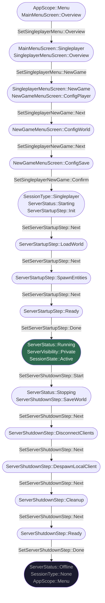
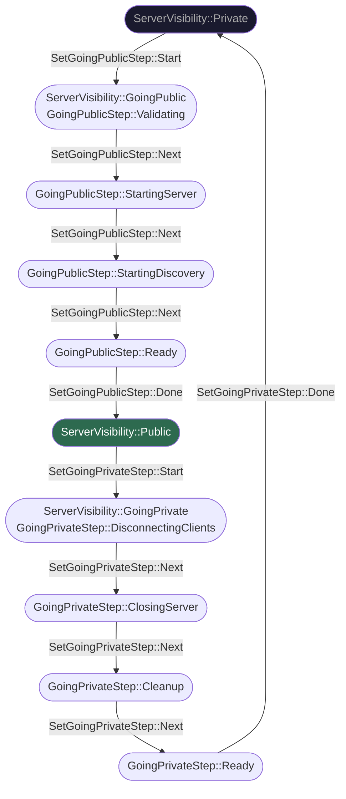

# chicken_states

State-Management für Bevy-basierte Spiele. Alle Übergänge laufen über Events, die von Observern validiert werden.

**Features:** `hosted` (grafischer Client) · `headless` (Dedicated Server)

---

## Design-Regel: Wann braucht ein Step-Event ein `Start`?

| Sequence | `Start`? | Begründung |
|----------|----------|------------|
| `ServerStartupStep` | ❌ | wird durch `Confirm` ausgelöst — Parent wird gesetzt, Step auto-init |
| `ConnectingStep` | ❌ | wird durch `JoinGame::Confirm` ausgelöst — selbe Logik |
| `ServerShutdownStep` | ✅ | bewusste Entscheidung aus stabilem Zustand `Running` |
| `GoingPublicStep` | ✅ | bewusste Entscheidung aus stabilem Zustand `Private` |
| `GoingPrivateStep` | ✅ | bewusste Entscheidung aus stabilem Zustand `Public` |
| `SyncingStep` | ✅ | bewusste Entscheidung aus stabilem Zustand `Connected` |
| `DisconnectingStep` | ✅ | bewusste Entscheidung aus stabilem Zustand `Playing` |

> **Regel:** Kein `Start` wenn ein `Confirm`-Event den Ablauf direkt initiiert (kein stabiler Zustand dazwischen). `Start` ist nötig wenn aus einem stabilen, laufenden Zustand heraus bewusst eine neue Sequenz begonnen wird. In beiden Fällen initialisiert sich der erste SubState-Step automatisch.

---

## Singleplayer — Start bis Stop

---

## Server Public & Private schalten

> Voraussetzung: `ServerStatus::Running`

---

## Multiplayer Host — Start bis Stop

Der Host-Flow ist identisch mit Singleplayer, mit zwei Unterschieden:
1. Konfiguration über `HostNewGame`-Menü
2. Nach `ServerStatus::Running` wird automatisch `GoingPublic` gestartet (`PendingGoingPublic` Resource)

```mermaid
flowchart TD
    A([AppScope::Menu\nMainMenuScreen::Overview])

    A -->|SetMultiplayerMenu::Overview| B
    B([MainMenuScreen::Multiplayer\nMultiplayerMenuScreen::Overview])

    B -->|SetMultiplayerMenu::HostNewGame| C
    C([MultiplayerMenuScreen::HostNewGame\nHostNewGameMenuScreen::ConfigServer])

    C -->|SetNewHostGame::Next| D([HostNewGameMenuScreen::ConfigWorld])
    D -->|SetNewHostGame::Next| E([HostNewGameMenuScreen::ConfigSave])

    E -->|SetNewHostGame::Confirm| F
    F([SessionType::Singleplayer\nServerStatus::Starting\nServerStartupStep::Init\n+ PendingGoingPublic])

    F -->|SetServerStartupStep::Next| G([ServerStartupStep::LoadWorld])
    G -->|SetServerStartupStep::Next| H([ServerStartupStep::SpawnEntities])
    H -->|SetServerStartupStep::Next| I([ServerStartupStep::Ready])
    I -->|SetServerStartupStep::Done| J([ServerStatus::Running])

    J -->|auto: PendingGoingPublic erkannt| K
    K([SetGoingPublicStep::Start\nServerVisibility::GoingPublic\nGoingPublicStep::Validating])

    K -->|SetGoingPublicStep::Next| L([GoingPublicStep::StartingServer])
    L -->|SetGoingPublicStep::Next| M([GoingPublicStep::StartingDiscovery])
    M -->|SetGoingPublicStep::Next| N([GoingPublicStep::Ready])
    N -->|SetGoingPublicStep::Done| O

    O([ServerVisibility::Public\nSessionState::Active])

    O -->|SetServerShutdownStep::Start| P
    P([ServerStatus::Stopping\nServerShutdownStep::SaveWorld])

    P -->|SetServerShutdownStep::Next| Q([ServerShutdownStep::DisconnectClients])
    Q -->|SetServerShutdownStep::Next| R([ServerShutdownStep::DespawnLocalClient])
    R -->|SetServerShutdownStep::Next| S([ServerShutdownStep::Cleanup])
    S -->|SetServerShutdownStep::Next| T([ServerShutdownStep::Ready])
    T -->|SetServerShutdownStep::Done| U

    U([ServerStatus::Offline\nSessionType::None\nAppScope::Menu])

    style O fill:#2d6a4f,color:#fff
    style U fill:#1a1a2e,color:#aaa
```

---

## Client — Verbinden bis Trennen

```mermaid
flowchart TD
    A([AppScope::Menu\nMainMenuScreen::Overview])

    A -->|SetMultiplayerMenu::Overview| B
    B([MainMenuScreen::Multiplayer\nMultiplayerMenuScreen::Overview])

    B -->|SetMultiplayerMenu::JoinGame| C
    C([MultiplayerMenuScreen::JoinGame\nJoinGameMenuScreen::Overview])

    C -->|SetJoinGame::Confirm| D
    D([AppScope::Session\nSessionType::Client\nClientConnectionStatus::Connecting\nConnectingStep::ResolveAddress])

    D -->|SetConnectingStep::Next| E([ConnectingStep::OpenSocket])
    E -->|SetConnectingStep::Next| F([ConnectingStep::SendHandshake])
    F -->|SetConnectingStep::Next| G([ConnectingStep::WaitForAccept])
    G -->|SetConnectingStep::Next| H([ConnectingStep::Ready])
    H -->|SetConnectingStep::Done| I([ClientConnectionStatus::Connected])

    I -->|SetSyncingStep::Start| J
    J([ClientConnectionStatus::Syncing\nSyncingStep::RequestWorld])

    J -->|SetSyncingStep::Next| K([SyncingStep::ReceiveChunks])
    K -->|SetSyncingStep::Next| L([SyncingStep::SpawnEntities])
    L -->|SetSyncingStep::Next| M([SyncingStep::Ready])
    M -->|SetSyncingStep::Done| N

    N([ClientConnectionStatus::Playing\nSessionState::Active])

    N -->|SetDisconnectingStep::Start| O
    O([ClientConnectionStatus::Disconnecting\nDisconnectingStep::SendDisconnect])

    O -->|SetDisconnectingStep::Next| P([DisconnectingStep::WaitForAck])
    P -->|SetDisconnectingStep::Next| Q([DisconnectingStep::Cleanup])
    Q -->|SetDisconnectingStep::Next| R([DisconnectingStep::Ready])
    R -->|SetDisconnectingStep::Done| S

    S([ClientConnectionStatus::Disconnected\nSessionType::None\nAppScope::Menu])

    style N fill:#2d6a4f,color:#fff
    style S fill:#1a1a2e,color:#aaa
```

